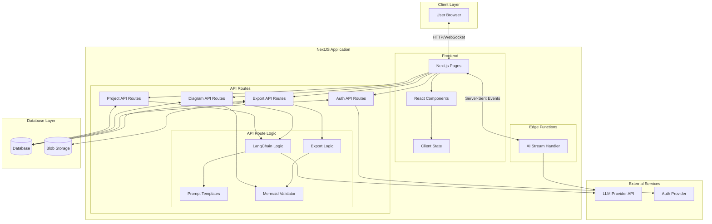

```mermaid
flowchart TD
    subgraph "Client Layer"
        Browser[User Browser]
    end
    
    subgraph "NextJS Application"
        subgraph "Frontend"
            Pages[Next.js Pages]
            Components[React Components]
            ClientState[Client State]
        end
        
        subgraph "API Routes"
            ProjectAPI[Project API Routes]
            DiagramAPI[Diagram API Routes]
            AuthAPI[Auth API Routes]
            ExportAPI[Export API Routes]
            
            subgraph "API Route Logic"
                LangChainHandler[LangChain Logic]
                PromptManager[Prompt Templates]
                MermaidValidator[Mermaid Validator]
                ExportLogic[Export Logic]
            end
        end
        
        subgraph "Edge Functions"
            AIStreamHandler[AI Stream Handler]
        end
    end
    
    subgraph "External Services"
        LLMProvider[LLM Provider API]
        AuthProvider[Auth Provider]
    end
    
    subgraph "Database Layer"
        DB[(Database)]
        BlobStore[(Blob Storage)]
    end
    
    %% Client to NextJS connections
    Browser <-->|HTTP/WebSocket| Pages
    
    %% Internal NextJS connections
    Pages --> Components
    Components --> ClientState
    Pages --> ProjectAPI
    Pages --> DiagramAPI
    Pages --> AuthAPI
    Pages --> ExportAPI
    Pages <-->|Server-Sent Events| AIStreamHandler
    
    %% API Route Logic connections
    ProjectAPI --> LangChainHandler
    DiagramAPI --> LangChainHandler
    DiagramAPI --> MermaidValidator
    ExportAPI --> ExportLogic
    
    LangChainHandler --> PromptManager
    ExportLogic --> MermaidValidator
    
    %% API to External Service connections
    LangChainHandler --> LLMProvider
    AIStreamHandler --> LLMProvider
    AuthAPI --> AuthProvider
    
    %% Database connections
    ProjectAPI <--> DB
    DiagramAPI <--> DB
    AuthAPI <--> DB
    ExportAPI <--> DB
    ExportAPI <--> BlobStore
```